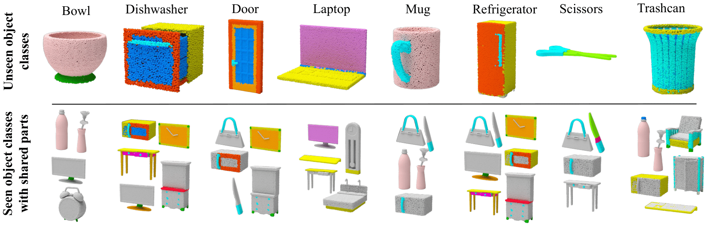

# 3D Compositional Zero-shot Learning (3DCZSL)
This is the official PyTorch code for ECCV2022 [3D Compositional Zero-shot Learning with DeCompositional Consensus](https://arxiv.org/pdf/2111.14673.pdf). This repository provides the dataset, experimental framework for 3DCZSL and our proposed method DeCompositional Consensus.

<p align="center">
  
</p>


## Compositional PartNet
We refine PartNet into Compositional PartNet (C-PartNet) with a new labeling scheme that relates the compositional knowledge between objects by merging and renaming the repeated labels. The dataset can be downloaded from: [Download Dataset.](https://drive.google.com/file/d/1rje0HNC9yM878PgksdNG9K6zIFPgFjui/view?usp=sharing)
<p align="center">
  
</p>
<p align="center">
  
</p>

## DeCompositional Consensus
DeCompositional Consensus (DCC), learns an agreement (Consensus) over a segmentation hypothesis and its partbased object classification score when the object is taken apart (DeComposed) into parts like lego blocks as segmented in the hypothesis. Pretrained model for our reported number in the manuscript can be downloaded from: [Download checkpoint.](https://drive.google.com/drive/folders/1uCmJQsDjUXMTGwxOwk-TWjqVk1fp7xmE?usp=sharing)

<p align="center">
  
</p>


## Setup

1. Clone the repo and cd to the folder.

2. Setup the python environment using requirements.txt.
```
    pip install -r requirements.txt # for pip
    conda install --file requirements.txt # for anaconda
```

3. Compile and install binaries.
```
    bash compile.sh
    cd shaper/models/convpoint/knn
    python setup.py install --home="."
    cd ../../../../
```

4. Edit the OUTPUT_DIR and DATASET.path in config_backbone.yaml according to your local configuration.

5. Train the PointNet backbone.
```
    python shaper/train_part_seg.py --cfg configs/config_backbone.yaml
```
6. Change the WEIGHT under MODEL in config.yaml to the trained PointNet ckpt.
7. Train DCC.
```
    python shaper/train_part_cls.py --cfg configs/config.yaml
```
8. Test the trained model
```
    python shaper/test_part_cls.py --cfg configs/config.yaml
```

## Acknowledgement
PointCloud backbones are adapted from the respective author implementations. Please consider citing them too. 


## References
If you use Compositional PartNet and/ or this code, please cite
```
@inproceedings{naeem2022dcc,
  title={3D Compositional Zero-shot Learning with DeCompositional Consensus},
  author={Naeem, Muhammad Ferjad and {\"O}rnek, Evin P{\i}nar and Xian, Yongqin and Van Gool, Luc and Tombari, Federico},
  booktitle={European Conference on Computer Vision},
  year={2022},
  organization={Springer}
}
```
